# 面向无人值守传感节点的电池与能量调度仿真

> **本科毕业论文数字仿真项目** | 基于 Samsung INR18650-20R 电池的传感节点剩余运行时间预测与自适应能量调度研究

这是一个 Python 数字原型，模拟无人值守传感节点的完整能量链路：**状态机 → 负载电流 → 电池响应 → 剩余时间预测 → 自适应能量调度**。项目生成 17 张仿真结果图，覆盖从节点工作状态到电池放电行为、预测器性能对比和调度策略评估的完整研究链。

**⚠️ 重要说明**：本项目使用 Samsung INR18650-20R 的**配置参数与示意性 OCV–SOC 表**。仓库目前没有原始电池实验数据，因此所有图表代表**模型仿真结果**，不代表实测电芯性能。

---

## 📊 仿真成果总览

项目包含 17 张已审核的仿真结果图，分为四个研究阶段。点击图片可查看大图。

### 阶段一：节点负载模型（图 1–3）

传感节点在 Sleep、Sampling、LoRa TX 三种状态间周期性切换，产生脉冲式负载电流。

| 图 1：节点状态时间线 | 图 2：负载电流脉冲 | 图 3：标称总线功率 |
|:---:|:---:|:---:|
| [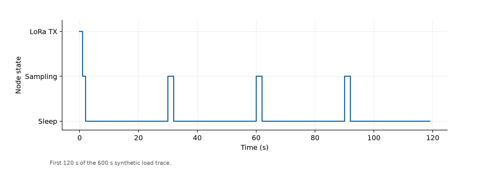](outputs/figures/fig1_state_timeline.png) | [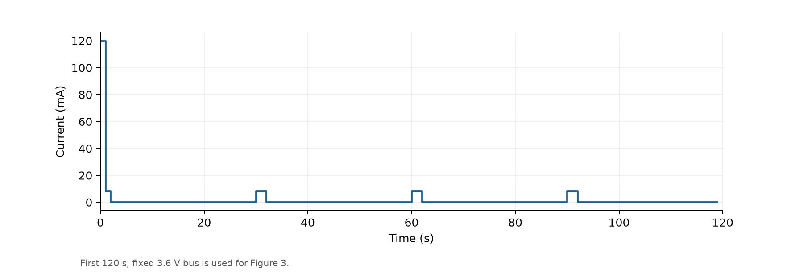](outputs/figures/fig2_current_consumption.png) | [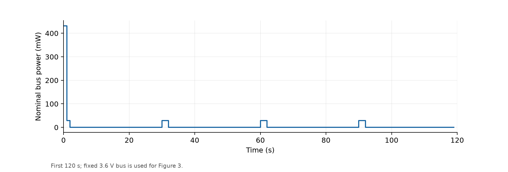](outputs/figures/fig3_load_power.png) |

**解读**：
- **图 1**：前 120 秒的状态序列。节点大部分时间处于 Sleep 状态（15 µA），周期性唤醒进行 Sampling（8 mA）和 LoRa TX（120 mA）。纵轴为离散状态而非连续测量值。
- **图 2**：负载电流脉冲清晰可见。TX 阶段的 120 mA 尖峰比 Sleep 阶段高出约 7 个数量级，这是低功耗传感节点的典型特征。
- **图 3**：基于固定 3.6 V 总线电压计算的标称功率脉冲。TX 阶段瞬时功率可达 ~430 mW，而 Sleep 阶段仅 ~54 µW。

> 📌 **注意**：为使脉冲细节可辨，图 1–3 仅展示前 120 秒，不代表完整仿真时长。

---

### 阶段二：电池模型响应（图 4–7）

将负载电流映射为电池的 SOC 消耗、端电压变化和剩余能量衰减。

| 图 4：OCV–SOC 曲线 | 图 5：电池端电压 | 图 6：电池功率 | 图 7：剩余能量 |
|:---:|:---:|:---:|:---:|
| [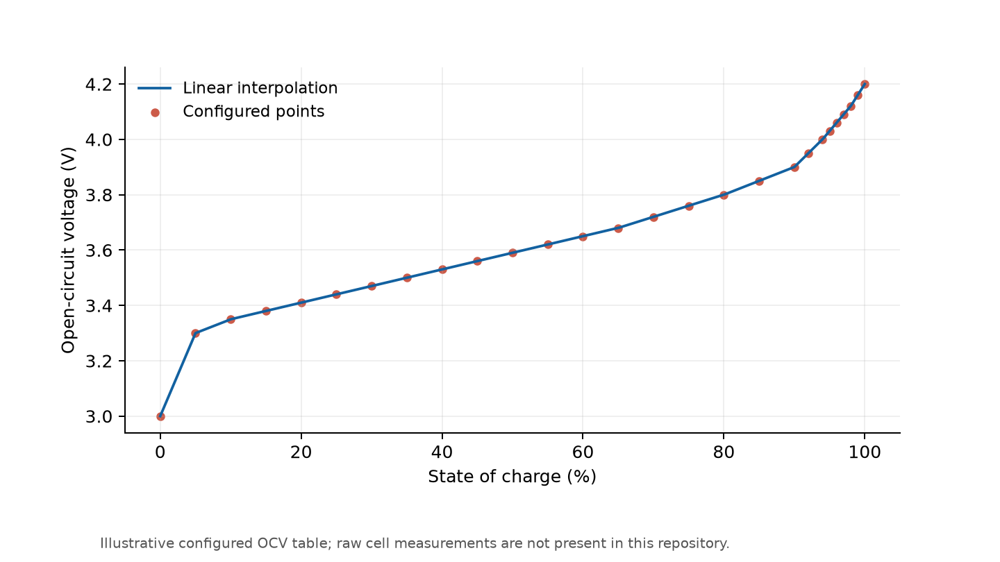](outputs/figures/fig4_ocv_soc.png) | [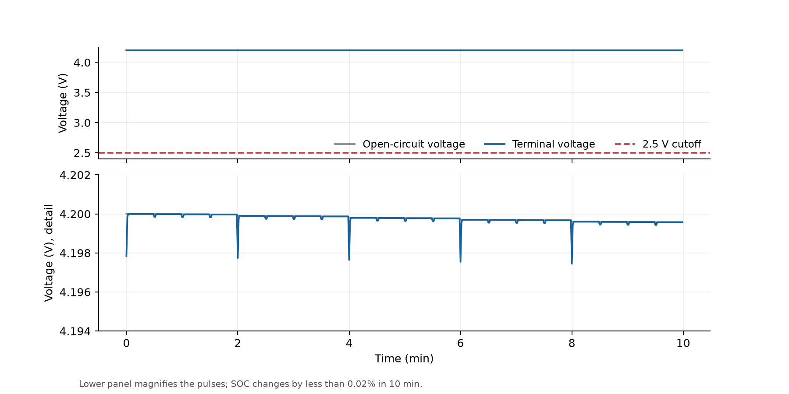](outputs/figures/fig5_battery_voltage.png) | [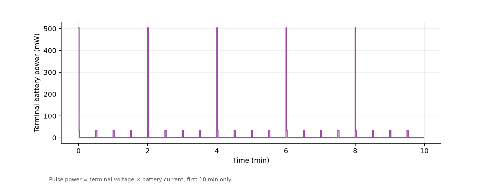](outputs/figures/fig6_battery_power.png) | [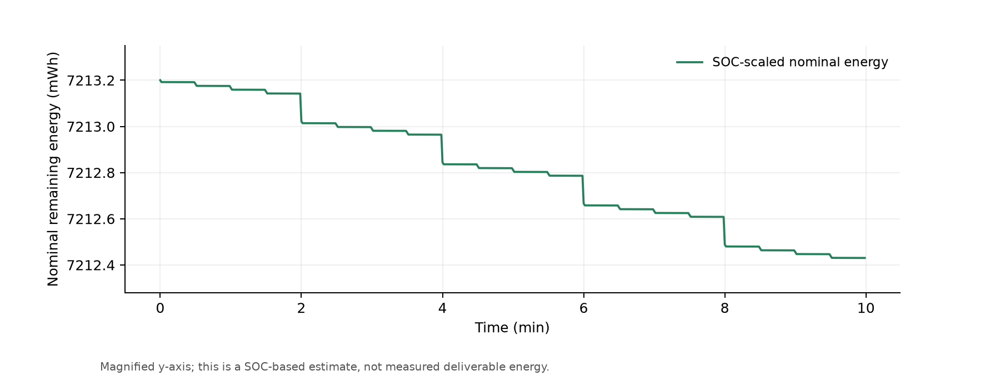](outputs/figures/fig7_energy_remaining.png) |

**解读**：
- **图 4**：OCV（开路电压）与 SOC（充电状态）的关系曲线。27 个配置点来自项目参数表，线性插值得到完整曲线。**这些点不是来自仓库中可核查的原始 CALCE 测量数据**，应视为示意性模型输入。
- **图 5**：10 分钟仿真内的端电压变化。上半图显示整体趋势（~3.6 V 起始），下半图放大到毫伏级，清晰显示 TX 脉冲引起的瞬时压降。2.5 V 为仿真截止电压红线。
- **图 6**：端电压 × 电池电流得到的短时功率脉冲。TX 阶段电池功率峰值与图 3 的负载功率对应。
- **图 7**：根据 SOC 推算的标称剩余能量。纵轴经过放大处理，数值不是实测可释放能量。

> 📌 **注意**：图 5–7 仅展示 10 分钟窗口，使用放大纵轴以凸显脉冲细节。电池模型采用固定内阻（0.018 Ω）、固定温度（25°C）、简化 DC/DC 效率与库仑计数，不包含老化、自放电或实测负载噪声。

---

### 阶段三：剩余运行时间预测器（图 8–11）

比较三种预测器在重负载场景下的性能：
- **Predictor A**：瞬时功率预测（当前功率倒数）
- **Predictor B**：滑动平均功率预测（30/60/300 s 窗口）
- **Predictor C**：基于状态模型的预测（已知状态比例和电流）

| 图 8：Predictor A | 图 9：Predictor B | 图 10：Predictor C | 图 11：预测器对比 |
|:---:|:---:|:---:|:---:|
| [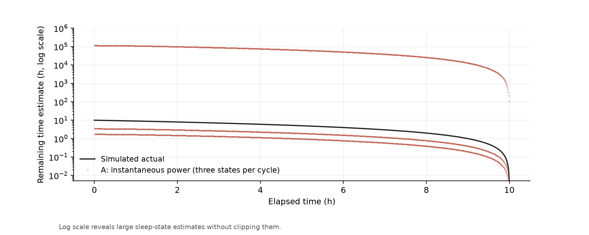](outputs/figures/fig8_predictor_a.png) | [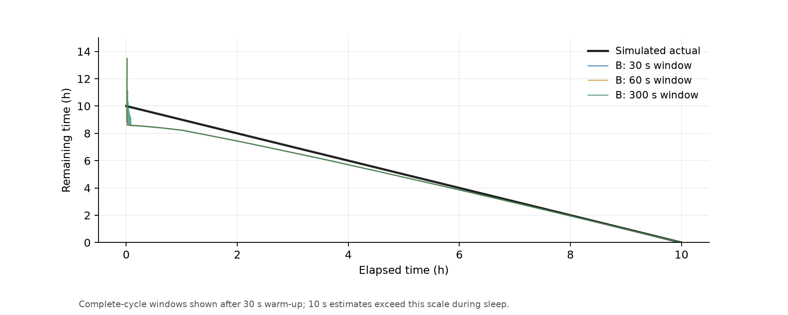](outputs/figures/fig9_predictor_b.png) | [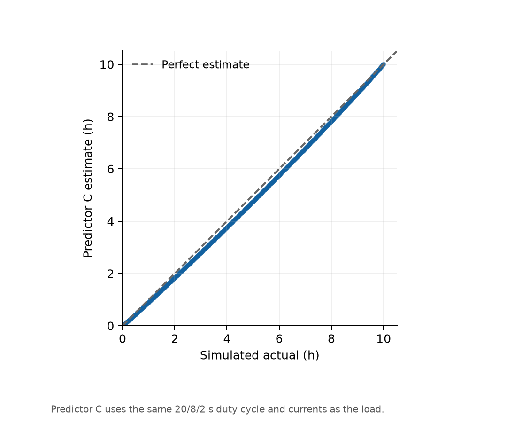](outputs/figures/fig10_predictor_c.png) | [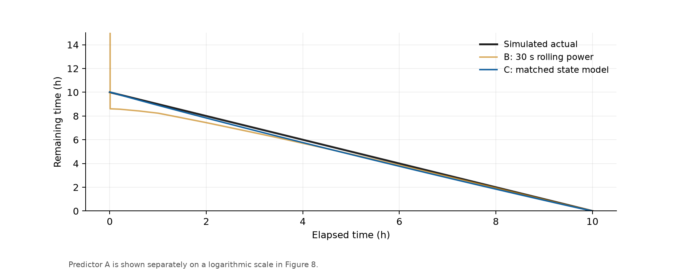](outputs/figures/fig11_predictor_comparison.png) |

**解读**：
- **图 8**：Predictor A 使用瞬时功率，Sleep 阶段功率极低导致预测值极大，因此纵轴采用**对数刻度**。预测值在 TX 阶段骤降，在 Sleep 阶段飙升至数千小时。
- **图 9**：Predictor B 使用滑动平均平滑功率波动。30 s 窗口（蓝色）响应最快但仍受脉冲影响；300 s 窗口（绿色）更平滑但滞后更明显。纵轴限制在 0–15 h。
- **图 10**：Predictor C 的预测值 vs 仿真实际剩余时间散点图。虚线表示理想预测（y=x）。C 使用与重负载一致的状态比例和电流参数，整体跟随趋势但存在系统性高估。
- **图 11**：三者对比（A 因量级差异单独展示）。Predictor C（橙色）最贴近真实剩余时间（蓝色），Predictor B 30s 窗口（绿色）次之。

**关键数值**（重负载实验，仿真截止约 10 h）：
| 预测器 | MAE (h) | 说明 |
|:---:|:---:|:---|
| Predictor B (30 s) | 0.320 | 排除前 30 s 预热期 |
| Predictor C | 0.168 | 使用匹配的状态参数 |

> 📌 **注意**：这些误差仅衡量对**同一简化仿真**的拟合程度，不能直接推广到真实硬件。完整数值见 `outputs/reviewed_predictor_metrics.csv`。

---

### 阶段四：自适应能量调度（图 12–17）

比较四种策略在 40 小时窗口内的表现：
- **High QoS**：高采样/发送频率
- **Balanced**：中等频率
- **Survival**：低频率，节能模式
- **Adaptive**：基于 Predictor C 的自适应调度（阈值 1 h）

| 图 12：调度模式变化 | 图 13：电池功率 | 图 14：剩余能量 |
|:---:|:---:|:---:|
| [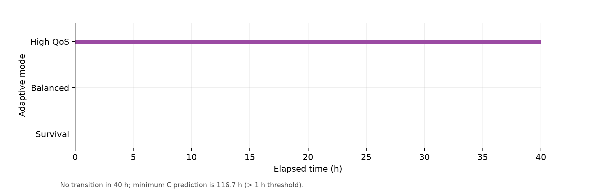](outputs/figures/fig12_scheduling_mode.png) | [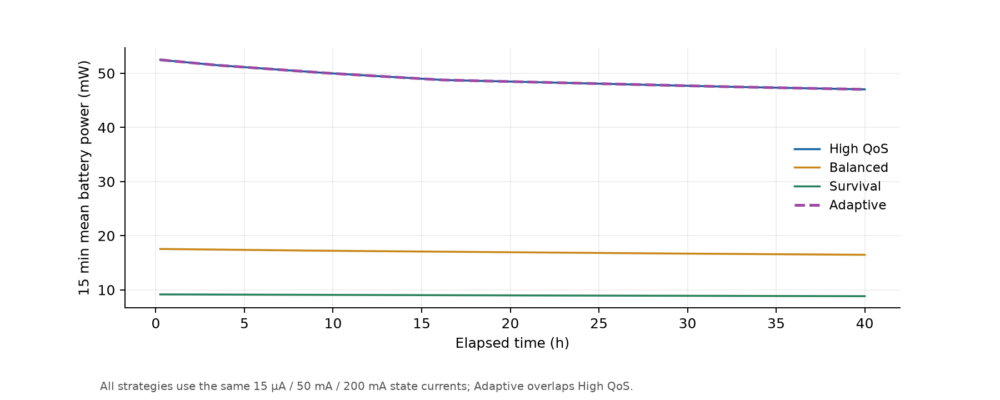](outputs/figures/fig13_battery_power.png) | [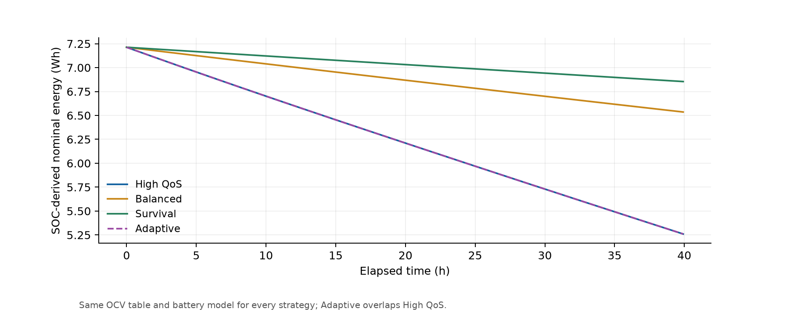](outputs/figures/fig14_energy_remaining.png) |

| 图 15：预测剩余时间 | 图 16：末端 SOC | 图 17：功耗-QoS 权衡 |
|:---:|:---:|:---:|
| [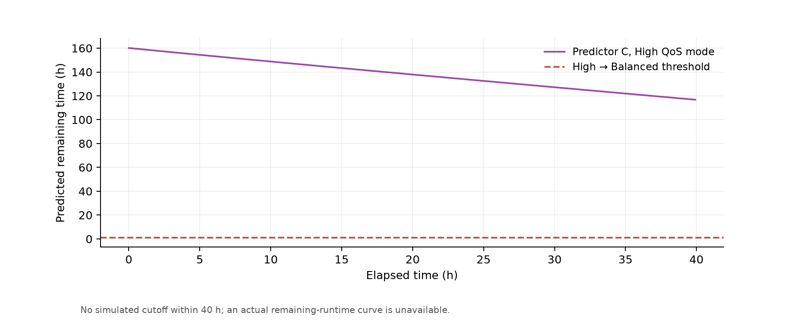](outputs/figures/fig15_runtime_prediction.png) | [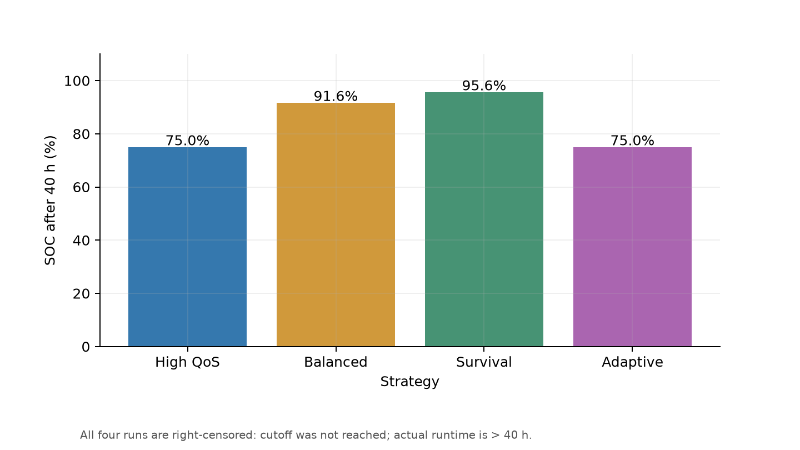](outputs/figures/fig16_runtime_comparison.png) | [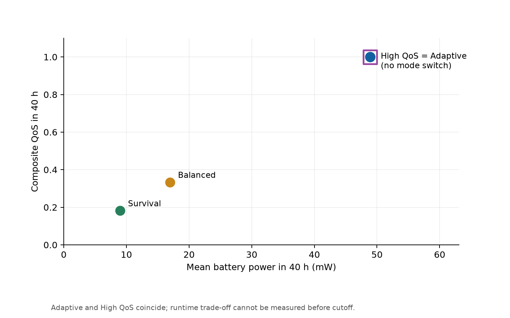](outputs/figures/fig17_runtime_qos_tradeoff.png) |

**解读**：
- **图 12**：Adaptive 模式在 40 h 内始终保持在 High QoS 状态，**没有发生任何模式切换**。原因是 Predictor C 系统性高估剩余时间，预测值始终高于 1 h 阈值。
- **图 13–14**：四种策略的电池功率和剩余能量趋势。Adaptive 与 High QoS 曲线**完全重合**，因为两者采样/发送行为完全相同。Balanced 和 Survival 消耗更慢。
- **图 15**：Adaptive 模式的预测剩余时间。红色虚线为 1 h 降级阈值。预测值始终高于阈值，因此未触发模式切换。
- **图 16**：40 h 末的末端 SOC 对比。**注意：这不是实际续航柱状图**。所有策略的实际续航只能表述为 **> 40 h**。
- **图 17**：平均功率 vs 综合 QoS。High QoS 和 Adaptive 使用同一复合标记（数值完全重合），Survival 在左下角（低功耗、低 QoS）。**图中没有测出续航–QoS 折中关系**。

**40 h 末端关键指标**：
| 策略 | 末端 SOC | 平均功率 (mW) | 综合 QoS | 模式切换次数 |
|:---:|:---:|:---:|:---:|:---:|
| High QoS | 75.0% | 48.9 | 1.00 | 0 |
| Balanced | 91.6% | 17.2 | 0.37 | 0 |
| Survival | 95.6% | 8.5 | 0.10 | 0 |
| **Adaptive** | **75.0%** | **48.9** | **1.00** | **0** |

> 📌 **关键发现**：在 40 h 窗口内，四组策略均未触发电池截止。Adaptive 模式因 Predictor C 高估剩余时间而始终维持 High QoS，与固定 High QoS 表现完全相同。**不能根据当前结果声称"续航–QoS 折中"已得到验证**，也**不能计算实际续航延长率**。完整数值见 `outputs/reviewed_scheduling_summary.csv`。

---

## 🔬 实验设置说明

17 张图来自**三组独立的实验场景**，使用不同的负载参数和观察窗口。**跨组比较数值前请先理解以下差异**：

| 实验组 | 图号 | 负载场景 | 观察窗口 | 主要输入 |
|:---:|:---:|:---|:---|:---|
| **A** | 1–7 | 短时演示 | 600 s（图 1–3 放大前 120 s） | `node_load_simulation.csv`<br>Sleep/Sampling/TX: 15 µA / 8 mA / 120 mA |
| **B** | 8–11 | 预测器评估 | ~10 h（运行到仿真截止） | 重负载: 15 µA / 500 mA / 1 A<br>周期: 20s/8s/2s |
| **C** | 12–17 | 调度策略对比 | 40 h（均未到截止） | 统一硬件: 15 µA / 50 mA / 200 mA |

> ⚠️ 三组实验**不可直接互换比较**。例如，图 5–7 的 10 分钟短时响应不能与图 12–17 的 40 小时趋势混为一谈；图 8–11 的重负载场景与图 12–17 的调度场景使用完全不同的电流值。

---

## 🛠️ 快速开始

### 安装

```bash
# 创建虚拟环境
python -m venv .venv

# 安装依赖（NumPy, pandas, SciPy, Matplotlib, pytest）
.venv/Scripts/python.exe -m pip install -r requirements.txt
```

### 最短复现流程

```bash
# 直接重建全部 17 张修订图表
.venv/Scripts/python.exe rebuild_reviewed_figures.py

# 从源码开始（需要先生成初始 CSV）
.venv/Scripts/python.exe run_simulation.py
.venv/Scripts/python.exe rebuild_reviewed_figures.py
```

> ⚠️ **命令顺序很重要**。`run_simulation.py` 会写入部分旧版同名图，最后运行 `rebuild_reviewed_figures.py` 才能确保 `outputs/figures/` 保存的是修订版。

### 验证图表数量

```bash
# PowerShell
(Get-ChildItem outputs\figures\fig*.png).Count  # 预期: 17

# Bash
ls outputs/figures/fig*.png | wc -l  # 预期: 17
```

### 运行测试

```bash
.venv/Scripts/python.exe run_tests.py
.venv/Scripts/python.exe run_battery_tests.py
.venv/Scripts/python.exe run_predictor_tests.py
.venv/Scripts/python.exe -m pytest -q
```

---

## 📁 项目结构

```
sensor-node-battery-runtime-simulation/
├── README.md                       # 本指南
├── requirements.txt                # Python 依赖
├── rebuild_reviewed_figures.py     # 重建 17 张修订图表
├── run_simulation.py               # 初始节点/电池仿真
├── run_tests.py / run_battery_tests.py / run_predictor_tests.py  # 独立检查
├── simulation/                     # 模型与参数
│   ├── config.py                   # 所有仿真参数（电池、负载、调度）
│   ├── node_model.py               # 节点状态 → 负载电流
│   ├── battery_model.py            # SOC → OCV → V_term → 功率
│   ├── predictor.py                # 预测器 A/B/C
│   └── scheduler.py                # 自适应调度规则
├── outputs/
│   ├── figures/                    # 17 张已审核 PNG + 逐图说明
│   ├── reviewed_predictor_metrics.csv
│   ├── reviewed_scheduling_summary.csv
│   └── *.csv                       # 其他仿真输出
├── docs/
│   └── FIGURE_REVIEW.md            # 图表审查记录与修订依据
└── tests/                          # pytest 单元测试
```

---

## ⚙️ 核心参数

| 参数 | 值 | 作用 |
|:---|:---|:---|
| `BATTERY_Q_NOMINAL_AH` | 2.0 Ah | Samsung INR18650-20R 标称容量 |
| `BATTERY_R0` | 0.018 Ω | 恒定电池内阻 |
| `V_TERMINAL_CUTOFF` | 2.5 V | 仿真截止端电压 |
| `OCV_SOC_POINTS` | 27 点 | SOC → 开路电压线性插值表 |
| `I_SLEEP / I_SAMPLING / I_TX` | 15 µA / 8 mA / 120 mA | 短时演示场景（图 1–7） |
| 预测实验负载 | 15 µA / 500 mA / 1 A | 重负载（图 8–11） |
| 调度实验负载 | 15 µA / 50 mA / 200 mA | 40 小时对比（图 12–17） |

完整参数见 `simulation/config.py`。

---

## ⚠️ 研究边界与局限性

在引用或撰写论文图注前，请务必理解以下局限：

1. **无原始电池数据**：`data/raw/` 当前仅有说明文件，没有 CALCE 原始压缩包。OCV 点应视为示意性输入，不能宣称实验拟合精度。
2. **简化模型**：固定内阻、固定温度（25°C）、简化 DC/DC 效率（=1.0）、库仑计数。无老化、自放电或实测负载噪声。
3. **调度未触发切换**：40 小时内 Predictor C 始终高估剩余时间，Adaptive 模式未发生降级。不能计算实际续航提升率。
4. **图 17 不证明续航-QoS 折中**：High QoS 和 Adaptive 数值重合，无法声称 trade-off 已验证。
5. **结果不可推广到硬件**：所有误差和指标仅衡量对同一简化仿真的内部一致性，未经真实电池或传感器硬件验证。

> 📖 详细的审查记录和问题修正见 [docs/FIGURE_REVIEW.md](docs/FIGURE_REVIEW.md)。

---

## 📝 常见问题

**Q: `ModuleNotFoundError` 怎么办？**
A: 确认已在项目根目录使用同一个虚拟环境安装和执行命令。

**Q: 图表看起来又变成旧版？**
A: 运行旧仿真脚本后，重新执行 `rebuild_reviewed_figures.py`。

**Q: 找不到原始电池数据？**
A: 当前仓库本来就没有该数据。现有图表可作为示意仿真复现，但不能当作 CALCE 原始数据分析结果。

**Q: 为什么图 16 不显示"实际续航"？**
A: 因为统一比较只观察了 40 小时，四组都没有达到截止。图 16 仅展示可观测的末端 SOC，所有实际续航只能表述为 **> 40 h**。

**Q: 旧版输出还能用吗？**
A: `run_predictor_eval.py`、`run_adaptive.py` 和 `simulation/main.py` 保留供历史追溯，但它们的预测与调度结论存在已知问题。正式报告应使用修订图表与 `reviewed_*.csv`。

---

## 📄 许可与引用

本项目为本科毕业论文《面向无人值守传感节点的剩余运行时间预测与自适应能量调度方法研究》的数字仿真部分。

电池数据基于 CALCE (University of Maryland) 的 Samsung INR18650-20R 测试，使用示意性配置参数。

如需引用，请注明：
- 本项目为示意性仿真，不代表实测电池性能
- 软件环境、参数版本和数据来源
- 模型局限性（见上方"研究边界与局限性"）
